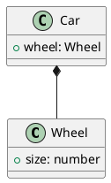

# tplant
Typescript to PlantUML

Will convert a Typescript file to a PlantUML file. Following all inheritances.

## Usage

```
npm install --global tplant
tplant --input sample/Classes/Greeter.ts --output sample/Classes/Greeter.puml
```

## Options

### -i, --input <path>
    Define the path of the Typescript file

### -o, --output <path>
    Define the path of the output file. If not defined, it'll output on the STDOUT

### -c, --compositions
    Create not heritage compositions.
    Example:
```typescript
class Wheel {
    public size: number;
}
class Car {
    public wheel: Wheel;
}
```

### -I, --only-interfaces
    Only output interfaces

# References
https://github.com/Microsoft/TypeScript/wiki/Using-the-Compiler-API
