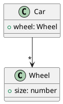

# tplant
Typescript to UML (PlantUML)

Will convert a Typescript file to UML diagram. Following all inheritances.

## Usage

### Install
```shell
npm install --global tplant
```

### Generate image file (svg or png)
```shell
tplant --input test/Playground/**/*.ts --output test/Playground/Playground.svg
tplant --input test/Playground/Classes/Greeter.ts --output test/Playground/Classes/Greeter.png
```
> Internet connection is required

### Generate puml file
```shell
tplant --input test/Playground/**/*.ts --output test/Playground/Playground.puml
tplant --input test/Playground/Classes/Greeter.ts --output test/Playground/Classes/Greeter.puml
```

## Options

### -i, --input <path>
    Define the path of the Typescript file

### -o, --output <path>
    Define the path of the output file. If not defined, it'll output on the STDOUT

### -p, --project <path>
    Compile a project given a valid configuration file.
    The argument can be a file path to a valid JSON configuration file, or a directory path to a directory containing a tsconfig.json file.

### -A, --associations
    Show associations between classes with cardinalities
    Example:
```typescript
class Wheel {
    public size: number;
}
class Car {
    public wheel: Wheel[];
}
```

### -I, --only-interfaces
    Only convert interfaces

### -f, --format mermaid

By default it is `plantuml`
If `mermaid` is specific, then the class diagram is generated for [mermaidjs](https://mermaid-js.github.io/mermaid/#/classDiagram)

### --targetClass MyClass

If specified will generated the hierarchy class diagram of the specified class

# References
https://github.com/Microsoft/TypeScript/wiki/Using-the-Compiler-API
