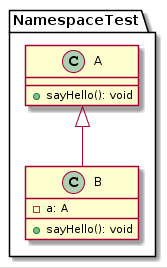

# Testing namespace with tplant
## Situation
- browser-application using namespaces
- classes in separate files referencing each other
- no import needed since classes sit in the same namespace
- scripts loaded and used in html-context
## Problem
tplant output is
```
@startuml
@enduml
```
as soon as the keyword `namespace` is used
## Desired
tplant output is
```
@startuml
namespace NamespaceTest {
  class A {
    +sayHello(): void
  }
  class B extends A {
    -a: A
    +sayHello(): void
  }
@enduml
```
Note: classes in the namespace are packed in the namespace section as supported by plantUML. Alternatively, the following shows the same result but with an inconsistency in property a of class B:
```
@startuml
class NamespaceTest.A {
    +sayHello(): void
}
class NamespaceTest.B extends NamespaceTest.A {
    -a: A
    +sayHello(): void
}
@enduml
```
### Resulting diagram

